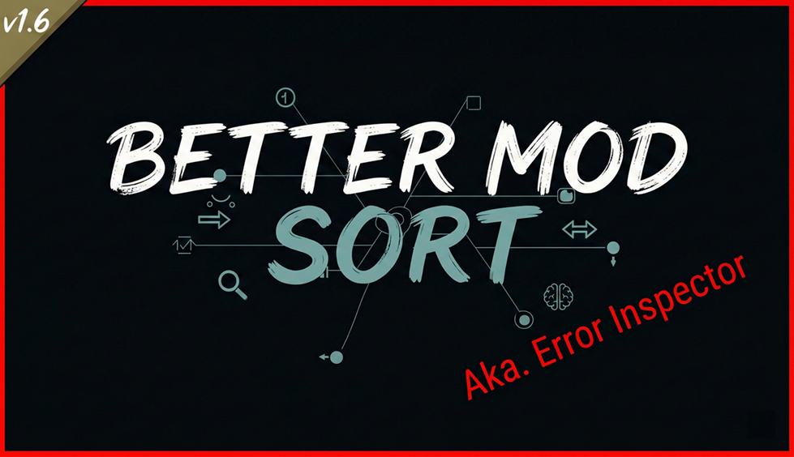

# Better Mod Sort (And Error Inspector)

[English](README.md) | [简体中文](README.zh.md)

<p align="center">
  
</p>

<p align="center">
  RimWorld 1.6 · 前置 MOD: <a href="https://steamcommunity.com/sharedfiles/filedetails/?id=2009463077">Harmony</a>
  ·
  <a href="https://steamcommunity.com/sharedfiles/filedetails/?id=3673408015">Steam 创意工坊页面</a>
</p>

---

## 这 MOD 干嘛的

装了一堆 MOD，不知道怎么排加载顺序？这个 MOD 可以接入大语言模型（LLM），让 AI 根据你的 MOD 列表和实际报错情况，帮你建议一个更合理的加载顺序。

为了让 AI 知道哪些 MOD 之间可能有冲突，MOD 会在后台自动拦截游戏运行时的报错，分析出是哪个 MOD 引起的，记录下来作为 AI 排序的参考依据。所以一般的用法是：**先正常玩一局（或者至少加载一次游戏），让 MOD 收集到足够的报错信息，然后再用 AI 排序**，效果会比较好。

当然，报错分析本身也有用，就算你不用 AI 排序，它也能帮你看清楚红字到底是谁的锅。

---

## 功能

### AI 辅助排序（实验性）

这是这个 MOD 的主要功能，默认关闭，需要在 MOD 设置里手动开启，并配好 LLM 的 API Key。

开启后，MOD 列表里的「自动排序」按钮会走 AI 流程：

1. **收集基础结构** — 为了节省 Token，引擎不会发送所有 MOD 的详细介绍，只收集所有激活 MOD 的名称和原版加载要求（如 `loadBefore` / `loadAfter` 等依赖关系）。
2. **提炼嫌疑 MOD 描述** — 只有曾在游戏中引发过报错的「嫌疑 MOD」，才会调用 LLM 将其描述浓缩为短描述（结果会缓存到本地，下次不必重复提炼）。
3. **生成软约束** — 将上述精简后的 MOD 信息和历史报错记录一并提交给 LLM，请求生成 `loadBefore` / `loadAfter` 形式的排序建议
4. **拓扑排序** — 将 AI 返回的软约束注入原版排序引擎，执行拓扑排序

所以要想 AI 排得准，最好先带着当前的 MOD 列表跑一次游戏，让报错分析系统积累一些数据。第一次用、什么报错数据都没有的时候也能排，只是 AI 能参考的信息会少一些。

注意 AI 排序会消耗 API Token，400 个 MOD 的情况下，Input 大约消耗 2 万 Token。

### 报错来源分析

这个功能装上就自动生效，不需要额外操作。它既是给 AI 排序提供数据的，也可以单独当排错工具用。

当游戏出现红色报错时，MOD 会从这几个方向去分析：

- **DLL 栈帧映射** — 从异常的调用栈里提取每一帧对应的程序集，反查是哪个 MOD 的 DLL。
- **XML 解析异常定位** — 拦截底层 XML 处理模块，将抛出异常的 XML 节点直接映射回来源文件与对应的 MOD 及具体的 XML NodePath。
- **Def 配置错误分析** — 深度拦截 Def 的配置警告报错，追踪其实际来源文件，提取它完整的 `ParentName` 继承链，并找出所有曾对该 Def 及其父节点下过手的 Patch 操作。
- **交叉引用溯源** — 深度解析 `Could not resolve cross-reference` 等链接引用错误，追查到具体是哪个 Def 在哪个文件里的哪个具体的 XML 节点使用该引用，并列出牵涉其中的 Patch 操作。
- **CE 兼容性归因** — 针对 `no support for Combat Extended` 的报错，通过深度反查异常堆栈的参数，精准揪出没有兼容 CE 的具体物品或种族 Def 来源。
- **文件路径与创意工坊 ID 提取** — 从 `Cannot load texture` 或找不到文件的红字里提取本地路径字符串，通过匹配启用 MOD 的根目录或解析路径中的 Steam 创意工坊 ID 来定位对应 MOD。

分析结果会保存到存档目录下的 `BetterModSort.Error.txt`，上次的会备份为 `BetterModSort.Error.prev.txt`。同时也会在游戏控制台（按 `~` 打开）里输出格式化的报告，大概长这样：

```text
Could not resolve cross-reference to Verse.WorkTypeDef named DoctorRescue (wanter=workTypes)
  -> [交叉引用被使用: DoctorRescue]
     - [Mod: Project RimFactory - Drones (spdskatr.projectrimfactory.drones)] Defs/ThingDef[defName=WarDroneStation]/modExtensions/li/workTypes
       File: D:\SteamLibrary\steamapps\workshop\content\294100\2037491557\Defs\ThingDefs_Buildings\Buildings_DroneStation.xml
  -> [Patch 可能涉及: WarDroneStation]
     - [Mod: Project RimFactory - Drones (spdskatr.projectrimfactory.drones)] PatchOperationAdd (FindMod: Achtung!)
```

```text
[BetterModSort] ========== 错误分析 ==========
时间: 10:10:20
错误: Trying to get stat MeleeDamageAverage from TM_GloryMaul which has no support for Combat Extended.
涉及的 MOD (3):
  - [ceteam.combatextended] Combat Extended
    DLL: CombatExtended
    位置: CombatExtended.StatWorker_MeleeDamageAverage.GetValueUnfinalized
  - [andromeda.nicebilltab] Nice Bill Tab
    DLL: NiceBillTab
    位置: NiceBillTab.StatRequestWorker.GetDPS
  - [ilyvion.loadingprogress] Loading Progress
    DLL: ilyvion.LoadingProgress
    位置: ilyvion.LoadingProgress.StaticConstructorOnStartupUtilityReplacement+d__2.MoveNext
=====================================
```

---

## 安装

### Steam 创意工坊

1. 订阅 [Better Mod Sort](https://steamcommunity.com/sharedfiles/filedetails/?id=3673408015)
2. 确保也订阅了 [Harmony](https://steamcommunity.com/sharedfiles/filedetails/?id=2009463077)
3. 在 MOD 列表中激活，Harmony 排在前面

### 手动安装

1. 下载 Release 或 clone 本仓库
2. 将 `Assets` 文件夹内容复制到 `Mods/BetterModSort/`
3. 编译项目，把生成的 DLL 放到 `Assemblies/` 目录下

---

## 设置

在游戏里点 **选项 → MOD 设置 → Better Mod Sort** 打开。

### AI 连接配置

- **LLM API Key** — 你的 API 密钥，留空则 AI 功能不可用
- **LLM Base URL** — API 地址，默认是 `https://api.openai.com/v1/chat/completions`。用 DeepSeek、Ollama 之类的兼容服务改成对应地址就行
- **LLM Model Name** — 模型名，默认 `gpt-4o`

### 实验性功能

- **启用 AI 辅助排序** — 勾上之后「自动排序」按钮会走 AI 流程，默认关闭
- **发送给 AI 的报错日志最大字符数** — 限制报错内容的长度，防止单个庞大报错占满上下文（默认 8000）
- **提炼短描述时截取原始描述的最大字符数** — 限制提取描述时的长度，节省 Token（默认 2500）
- **LLM 请求超时时间（秒）** — 设置单次请求的最大等待时间（默认 600 秒）

### 调试选项

- **启用 Debug Dump** — 把每次 LLM 通信的关键摘要信息写到文件里，方便排查提示词带来的影响。文件在 `%LOCALAPPDATA%Low/Ludeon Studios/RimWorld by Ludeon Studios/BetterModSort/Dump/` 下面
- **打开数据文件夹** — 在游戏内点击可以直接通过资源管理器打开 MOD 的数据存放目录，包含 `Dump`（LLM 通信总结日志）、`ShortDesc`（AI 提炼的 Mod Desc 摘要缓存）以及 `BetterModSort.Error.txt`（报错分析记录文件）。

---

## 多语言

目前支持英语、简体中文和俄语。

翻译文件在 `Assets/Languages/<语言>/Keyed/BetterModSort.xml`，欢迎提 PR 补充其他语言。

---

## 项目结构

```txt
BetterModSort/
├── Assets/
│   ├── About/                 # MOD 元信息、预览图
│   └── Languages/             # 翻译文件
├── AI/
│   ├── Dialog_AILoading.cs    # AI 排序进度弹窗
│   ├── LLMClient.cs           # OpenAI 兼容的 HTTP 客户端
│   ├── MetaDataManager.cs     # 嫌疑 MOD 名单 & 短描述缓存的持久化
│   └── PromptBuilder.cs       # 构建各类 Prompt
├── Core/
│   └── ErrorAnalysis/         # 错误分析核心
│       ├── Enrichers/         # 各种具体的错误类型处理器 (XML, CE, DefConfig等)
│       ├── CapturedErrorInfo.cs
│       ├── ErrorAnalyzer.cs
│       ├── ErrorHistoryManager.cs
│       ├── IEnrichmentData.cs # Enrichment 数据统一接口
│       └── IErrorEnricher.cs  # Enricher 统一接口
├── Hooks/
│   ├── ErrorCaptureHook.cs    # 错误发生时的拦截入口
│   ├── LogPatch.cs            # Hook Log.Error / ErrorOnce
│   ├── ModsConfigPatch.cs     # 替换自动排序 & 重复 MOD 检测
│   └── XmlSource.cs           # Hook 游戏资源加载以建立追踪
├── Tools/
│   ├── DllLookupTool.cs       # DLL ↔ MOD 映射
│   ├── I18n.cs                # 早期多语言加载
│   ├── ModInfo.cs             # 统一的 MOD 信息实体
│   └── XmlSourceMap.cs        # Def/Patch 的来源追踪储存字典
├── BetterModSortMod.cs        # MOD 入口
└── BetterModSortSettings.cs   # 设置定义
```
